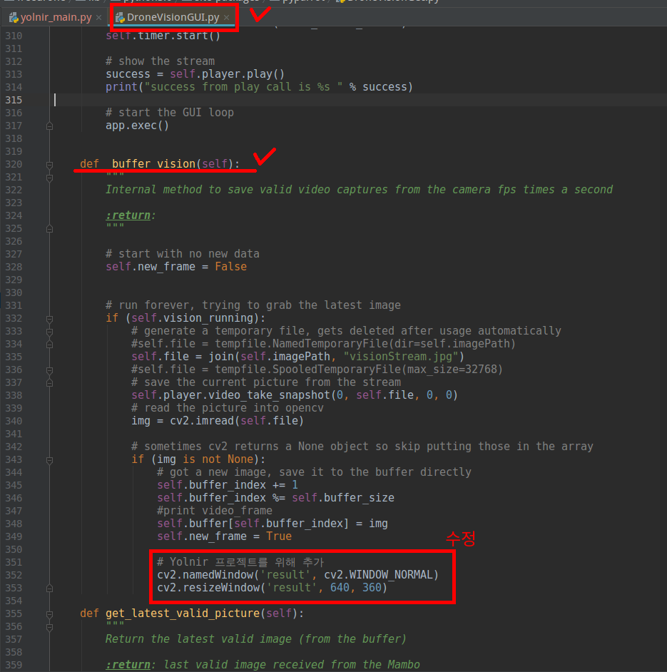

# Yolnir : YOLOv3 Color-Centroid Target Tracking Drone (Parrot)
###### Postech Pirl Intern Project Team3

## 준비하기 1
docs 폴더로 이동한 뒤

    pip install -r requirements.txt

One Drive 에 올려진 weight 파일을 다운 받는다

[weight 다운받기]()

그외 깃허브 링크 참고하기

[PyParrot 깃허브](https://github.com/amymcgovern/pyparrot)

[YOLOv3 Tensorflow 깃허브](https://github.com/YunYang1994/tensorflow-yolov3)

## 준비하기 2
코드를 돌리기 위해선 pyparrot 패키지의 코드를 일부 수정해야 한다.

pyparrot 패키지속 DroneVisionGUI 클래스 멤버 함수중 buffer_vision 을 다음과 같이 수정한다.

그 이유는 OpenCV 화면을 강제로 띄우기 위함이다.

## 사용하기

본 코드를 본격적으로 돌리기 전에

웹캠이 정상작동하는지 참고한 뒤 

yolov3_threading_test 먼저 돌려볼 것을 권장함.

이후에 드론에 연결하고 yolnir_main.py를 시행하면 된다.

## 그외

ghk9204@gmail.com 연락 바람.